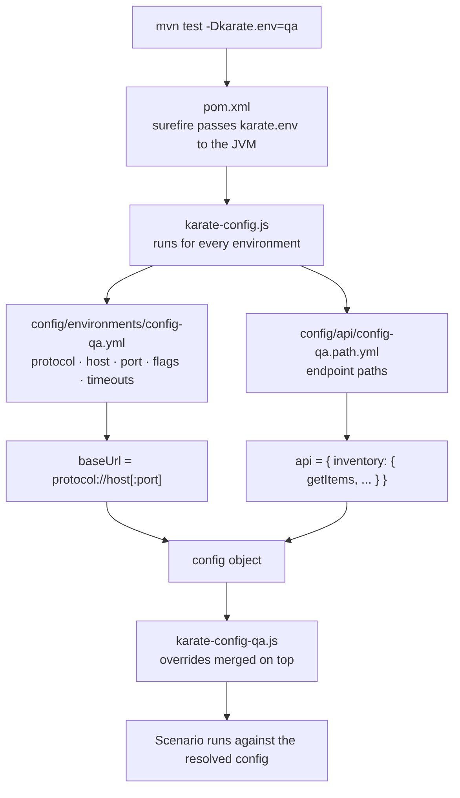

# home-test-api

API test automation for the **"automationapptest"** challenge — QA Automation, QUBEYOND.

Built with [Karate](https://github.com/karatelabs/karate) on JUnit 5 and Maven. The suite is
multi-environment: the same feature files run against `local`, `dev`, `qa`, `staging` or `prod`
by changing a single command-line flag.

---

## 1. Requirements

| Software | Version | Notes |
|---|---|---|
| **JDK** | 11 or higher | `pom.xml` compiles to Java 11. Verified on JDK 21. |
| **Maven** | 3.8 or higher | Verified on 3.8.4. |
| **Git** | any | To clone the repository. |
| Karate | 1.4.1 | Resolved automatically by Maven — no manual install. |
| JUnit 5 | — | Pulled in transitively by `karate-junit5`. |

No global Karate installation, Node.js or IDE plugin is needed. Maven downloads everything on the
first build.

**Verify your toolchain:**

```bash
java -version
mvn -v
```

**For `local` runs only:** the API under test must be listening on `http://localhost:3100`.
Start it before running the suite, otherwise every scenario fails with connection refused.

> The hosts configured for `dev`, `qa`, `staging` and `prod` (`api.develop.com`, `api.qa.com`,
> `api.staging.com`, `api.production.com`) are placeholders. Point them at real endpoints in
> `src/resources/config/environments/` before using those environments.

---

## 2. Project structure

```
home-test-api/
├── README.md
├── .gitignore
└── qubeyond/
    ├── pom.xml                                  ← dependencies, classpath, default environment
    └── src/
        ├── resources/                           ← test classpath root
        │   ├── karate-config.js                 ← base config: loads the YAML for the active env
        │   ├── karate-config-dev.js             ← per-environment overrides (logic only)
        │   ├── karate-config-qa.js
        │   ├── karate-config-staging.js
        │   ├── karate-config-prod.js            ← reads credentials from environment variables
        │   ├── logback-test.xml                 ← logging configuration
        │   ├── config/
        │   │   ├── environments/                ← WHERE each environment lives
        │   │   │   ├── config-local.yml
        │   │   │   ├── config-dev.yml
        │   │   │   ├── config-qa.yml
        │   │   │   ├── config-staging.yml
        │   │   │   └── config-prod.yml
        │   │   └── api/                         ← WHICH endpoints exist
        │   │       ├── config-local.path.yml
        │   │       ├── config-dev.path.yml
        │   │       ├── config-qa.path.yml
        │   │       ├── config-staging.path.yml
        │   │       └── config-prod.path.yml
        │   ├── utils/data/                      ← JSON fixtures
        │   │   ├── dataset/inventory.json       ← shared default
        │   │   ├── dataValidation/inventory.json
        │   │   ├── schemes/inventory.json
        │   │   └── <folder>/<env>/inventory.json ← optional per-environment override
        │   └── features/
        │       └── operations/
        │           └── inventory/
        │               └── inventory.feature    ← the tests
        └── test/java/
            └── karate/KarateRunnerTest.java     ← JUnit 5 entry point
```

---

## 3. Architecture

The design principle is a strict separation between **data** and **logic**:

- **YAML files hold data** — hosts, ports, protocols, timeouts, feature flags, endpoint paths, and
  the seed data the assertions depend on. Adding an environment means adding files, not editing code.
- **JavaScript files hold logic** — anything YAML cannot express: reading secrets from the
  environment, validating preconditions, conditional setup.
- **Feature files hold intent** — they never contain a URL, a hardcoded path, a fixed id or a fixed
  count. They reference `baseUrl`, `api.*` and `testData.*`, so the same scenario is
  environment-agnostic.
- **Nothing is shared between scenarios** — `call read('...@tag')` hands the caller back the called
  scenario's variables, so assertions read `response` and `responseStatus` straight off the
  returned value. The suite runs on 5 threads, and no scenario can observe another's state.

### Configuration resolution chain



**Step by step:**

1. `-Dkarate.env=<env>` is passed on the command line. If omitted, `pom.xml` supplies the default
   (`local`), forwarded to the forked test JVM via surefire's `systemPropertyVariables`.
2. `karate-config.js` runs first for every scenario. It reads `karate.env`, then loads the matching
   pair of YAML files from the classpath.
3. It assembles `baseUrl` from `protocol` + `host` + optional `port`, exposes the endpoint paths as
   `api`, and applies `ssl`, `connectTimeout` and `readTimeout` via `karate.configure`.
4. Karate then loads `karate-config-<env>.js` if present and **merges its return value over** the
   base config. This is where per-environment logic lives.
5. Feature files consume the resulting variables.

### What each layer contains

**`config/environments/config-<env>.yml`** — the environment definition, including the seed data
the scenarios assert against:

```yaml
url:
  protocol: http
  host: localhost
  port: 3100

config:
  debug: true
  ssl: false
  connectTimeout: 5000
  readTimeout: 5000
  mockExternalServices: true

testData:
  filterId: "3"          # id used by the filter-by-id scenarios
  existingItemId: "1"    # id that must already exist, so POSTing it returns 400
  minItemCount: 9        # smallest catalogue size the menu scenario accepts
```

Without `testData` the scenarios would carry ids and counts that only hold for one environment,
and pointing the suite elsewhere would mean editing feature files. Every environment declares its
own values instead.

**`config/api/config-<env>.path.yml`** — the endpoint catalogue:

```yaml
inventory:
  getItems: /api/inventory
  filterById: /api/inventory/filter
  addItem: /api/inventory/add
```

**`karate-config-<env>.js`** — logic-only overrides. `dev`, `qa` and `staging` are stubs returning
`{}`; `prod` reads credentials from environment variables and fails fast when they are absent:

```javascript
var apiKey = java.lang.System.getenv('PROD_API_KEY');
if (!apiKey) {
  throw new Error('PROD_API_KEY environment variable is required');
}
```

**`inventory.feature`** — no URLs, no hardcoded paths:

```gherkin
Background:
    * url baseUrl

@validation_items
Scenario: Validation keys items
    Given path api.inventory.getItems
    When method GET
    Then status 200
```

### Variables available in every scenario

| Variable | Description |
|---|---|
| `env` | Active environment name, lowercased. |
| `baseUrl` | Full base URL assembled from the environment YAML. |
| `api` | Endpoint paths, e.g. `api.inventory.getItems`. |
| `testData` | Seed data the scenarios assert against — `filterId`, `existingItemId`, `minItemCount`. |
| `debugMode` | When true, enables verbose request/response logging in console and report. |
| `mockExternalServices` | Flag for scenarios that need to branch on mocking. |
| `credentials` | **`prod` only** — `apiKey` and `clientSecret` from environment variables. |

---

## 4. Running the tests

All commands run from the **`qubeyond`** directory (the one containing `pom.xml`):

```bash
cd qubeyond
```

### Basic runs

| Goal | Command |
|---|---|
| Full suite, `local` (default) | `mvn test` |
| Full suite, specific environment | `mvn test '-Dkarate.env=qa'` |
| Single tag | `mvn test '-Dkarate.options=--tags @validation_items'` |
| Tag + environment | `mvn test '-Dkarate.env=qa' '-Dkarate.options=--tags @validation_items'` |
| Clean run | `mvn clean test` |

Valid environments: `local`, `dev`, `qa`, `staging`, `prod`.

### ⚠️ Shell quoting

**PowerShell requires single quotes around each `-D` argument.** Without them PowerShell mangles
the arguments and Maven fails with `Unknown lifecycle phase ".env=local"`. The quotes also stop
PowerShell from interpreting `@` as a splatting operator:

```powershell
mvn test '-Dkarate.env=local' '-Dkarate.options=--tags @validation_items'
```

In **Bash / Git Bash** the conventional form works:

```bash
mvn test -Dkarate.env=local -Dkarate.options="--tags @validation_items"
```

### Tag filtering

Tags are declared above a scenario:

```gherkin
@validation_items
Scenario: Validation keys items
```

| Selection | Option |
|---|---|
| One tag | `--tags @validation_items` |
| Either tag (OR) | `--tags @smoke,@regression` |
| Both tags (AND) | `--tags @smoke --tags @regression` |
| Exclude a tag | `--tags ~@wip` |

### Running against production

Production refuses to start without credentials, by design:

```powershell
$env:PROD_API_KEY = "..."
$env:PROD_CLIENT_SECRET = "..."
mvn test '-Dkarate.env=prod'
```

```bash
PROD_API_KEY=... PROD_CLIENT_SECRET=... mvn test -Dkarate.env=prod
```

### Running from an IDE

Run `KarateRunnerTest` directly. It defaults to `local`; select another environment by adding
`-Dkarate.env=qa` to the run configuration's VM options.

---

## 5. Reports

After any run:

```
qubeyond/target/karate-reports/karate-summary.html
```

Open it in a browser for the full HTML report. Cucumber-compatible JSON is emitted alongside it
(`outputCucumberJson(true)` in the runner) for CI tools that consume that format.

When `debug: true` is set for the environment, full request and response bodies are captured in
both the console and the report.

---

## 6. Extending the suite

### Adding an environment

1. Create `src/resources/config/environments/config-<env>.yml`, including its `testData` block.
2. Create `src/resources/config/api/config-<env>.path.yml`.
3. Optionally create `karate-config-<env>.js` for logic-only overrides.
4. Optionally add `utils/data/<folder>/<env>/<name>.json` when a JSON fixture differs from the
   shared default — most notably `dataValidation/<env>/inventory.json`, which must describe the
   record for that environment's `testData.filterId`.
5. Run it: `mvn test '-Dkarate.env=<env>'`.

No change to `karate-config.js` and no change to any feature file is required — resolution is by
naming convention.

### Environment-scoped test data

`functions.getSchemaJsonByName`, `getDataValidationJsonByName` and `getDataSetJsonByName` resolve
in two steps (`utils/functions/DinamicsCalls.js`):

```
utils/data/<folder>/<env>/<name>.json   ← used when present
utils/data/<folder>/<name>.json         ← shared default otherwise
```

An environment only needs its own copy when its data actually differs, so there is no duplication
by default. Scenarios call these loaders by name only and never know which file was used.

### Adding an endpoint

Add it to the `config-<env>.path.yml` files, then reference it as `api.<resource>.<operation>`.

### Adding a feature

Drop any `.feature` file under `src/resources/features/`. The runner picks up the whole tree via
`Runner.path("classpath:features")` — no registration needed.

---

## 7. Secrets

Credentials are never committed. They are read from environment variables at runtime and validated
in `karate-config-prod.js`. `.gitignore` excludes `config-*-secrets.yml` and `credentials.yml`.

Note that `.gitignore` also carries a broad `*-local.yml` rule, with an explicit exception for
`config/**/config-local*.yml` — that file defines the local environment, contains no secrets, and
must stay in version control so a fresh clone can run `mvn test` out of the box.
